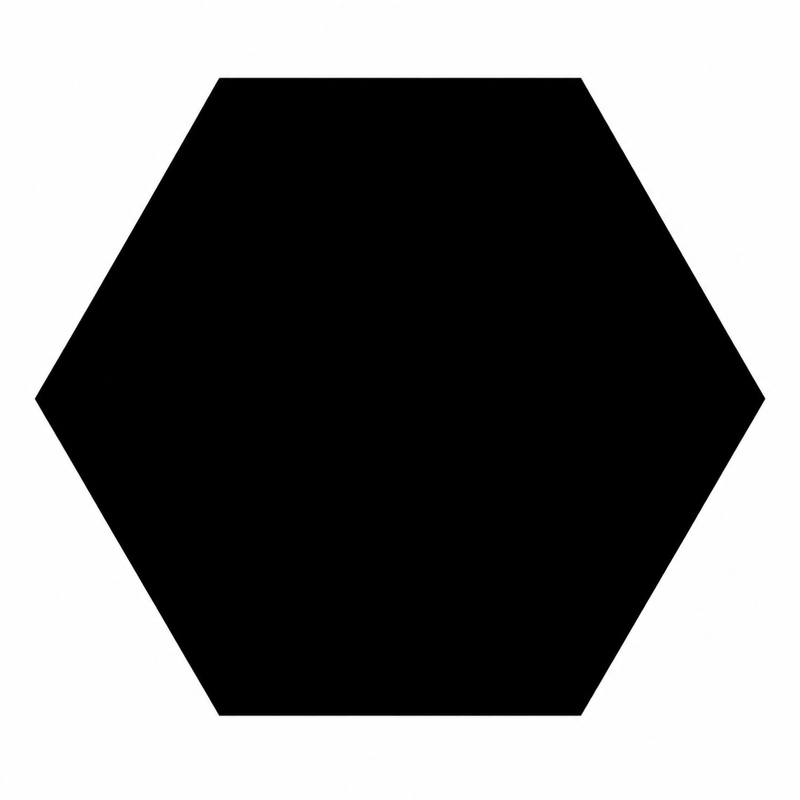
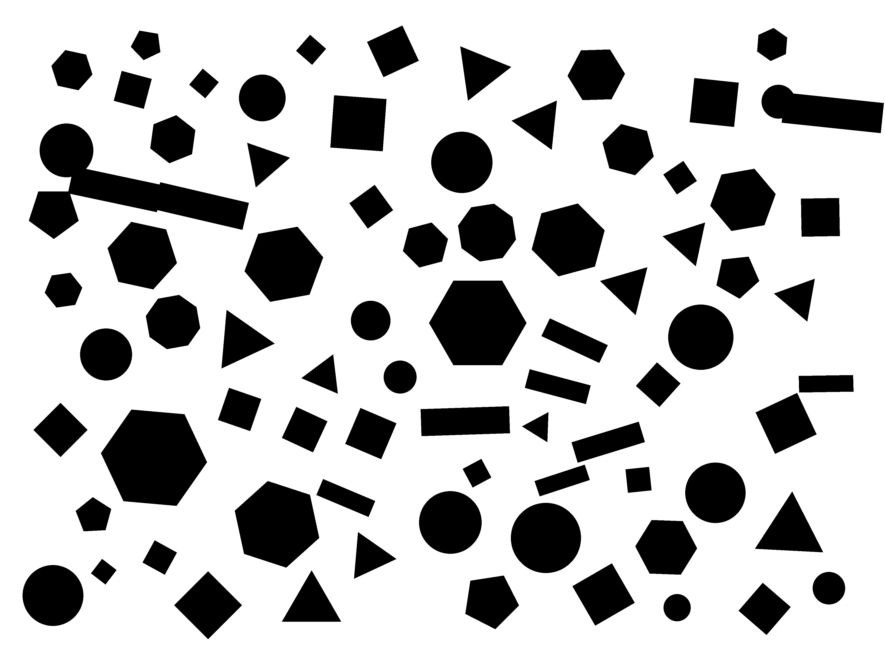
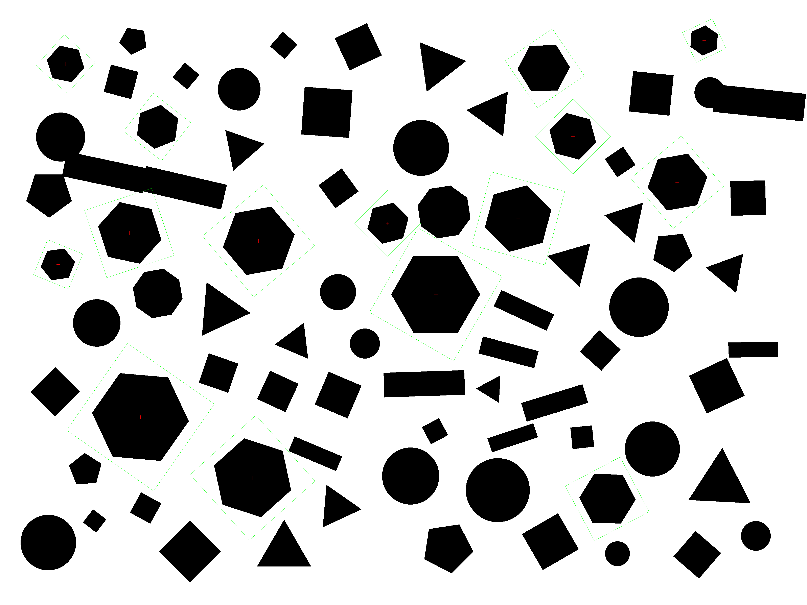

# rust-templateMatching-pure

Pure-Rust template matching — no OpenCV, no C dependencies, no cmake.  
Finds one or more occurrences of a template image inside a scene image,
with optional rotation and scale invariance.

**[Try it online →](https://template-matching.clubmate.space/)**  
Upload your own images and explore rotation- and scale-invariant matching in the browser — no install needed.

## Features

- **Pure Rust** — no system libraries, compiles anywhere `rustc` runs
- **Single dependency** — [`image`](https://crates.io/crates/image) for PNG/JPEG/BMP I/O
- **Rotation invariant** — searches a configurable angle range
- **Scale invariant** — searches a configurable scale range (multi-scale pyramid)
- **Multi-match** — finds and ranks all occurrences above a score threshold
- **SIMD-accelerated** — LLVM emits NEON / AVX2 for the inner correlation loop

## Build

```bash
cargo build --release
```

## Usage

```bash
./target/release/rust_tm_pure <template> <scene> [score_thresh] [max_count] [angle] [min_area] [scale_min] [scale_max]
```

| Argument | Default | Description |
|---|---|---|
| `score_thresh` | `0.7` | Minimum match score (0–1) |
| `max_count` | `10` | Maximum number of matches to return |
| `angle` | `0.0` | Half-range of rotation search in degrees (e.g. `30` → searches ±30°) |
| `min_area` | `256` | Minimum template area in pixels (controls pyramid depth) |
| `scale_min` | `1.0` | Minimum scale factor to search (e.g. `0.5` = half size) |
| `scale_max` | `1.0` | Maximum scale factor to search (e.g. `2.0` = double size) |

Set `scale_min = scale_max = 1.0` (the default) to skip scale search and use the fast single-scale path.

## Examples

### Basic matching

| Template | Scene | Result |
|:---:|:---:|:---:|
|  |  |  |

```bash
./target/release/rust_tm_pure examples/template_matching_template.png examples/template_matching_scene.png 0.7 5
```

```
Results (2 matches):
  [0]  center: (333.0, 111.0)   angle: 0.00°  score: 1.0000  scale: 1.0000
  [1]  center: (1423.0, 111.0)  angle: 0.00°  score: 0.8142  scale: 1.0000

match_image: ~4 ms  (Apple M-series, release build)
```

---

### Rotation + scale invariance

Finds all 15 hexagons across scales 0.10–0.45 and rotations up to ±50°,
among hundreds of distractors (circles, squares, triangles, pentagons, …).

| Template | Scene | Result |
|:---:|:---:|:---:|
|  |  |  |

```bash
./target/release/rust_tm_pure examples/hexagon_template.png examples/hexagon_scene.png \
    0.96 100 50 256 0.10 0.45
```

```
Results (15 matches):
  [0]  center: (2840, 677)   angle:  45.0°  score: 0.9972  scale: 0.2100
  [1]  center: (1282, 1195)  angle: -49.9°  score: 0.9960  scale: 0.3147
  [2]  center: (2160, 1460)  angle:  60.0°  score: 0.9943  scale: 0.3844
  ...
  [14] center: (641, 1155)   angle: -71.7°  score: 0.9807  scale: 0.2800

match_image: ~4 500 ms  (Apple M-series, release build, 4000×3000 scene, 71 scale steps)
```

All 15 hexagons found, 0 false positives at threshold 0.96.  
Score gap between hexagons (≥ 0.98) and all distractors (≤ 0.94) is > 37 points.

## Performance

Timings on Apple M-series (release build, `opt-level = 3`):

| Mode | Template | Scene | Time |
|---|---|---|---|
| No rotation, no scale | 214×210 | 1752×1754 | ~4 ms |
| Rotation ±30° | 214×210 | 1752×1754 | ~55 ms |
| Rotation ±30° + scale 0.5–1.5 | 214×210 | 1752×1754 | ~780 ms |
| Rotation ±50° + scale 0.10–0.45 | 1254×1254 | 4000×3000 | ~4 500 ms |

The scale loop runs fully parallel across all CPU cores via `std::thread::scope`.

## Contributing

Feedback, bug reports, and pull requests are welcome — feel free to open an issue or reach out.

## Credits

This project is a pure-Rust reimplementation of algorithms from:

- [DennisLiu1993/Fastest_Image_Pattern_Matching](https://github.com/DennisLiu1993/Fastest_Image_Pattern_Matching)
- [acai66/opencv_matching](https://github.com/acai66/opencv_matching)
