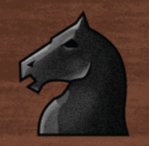
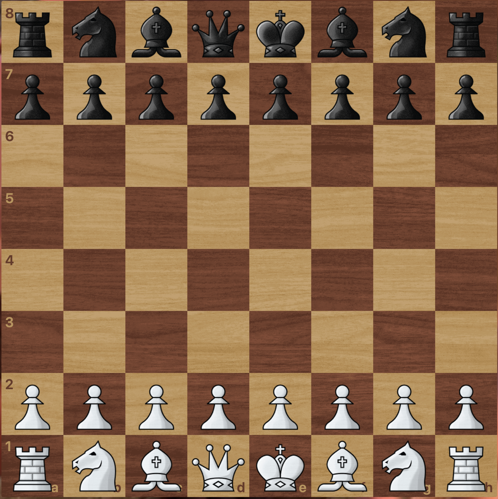
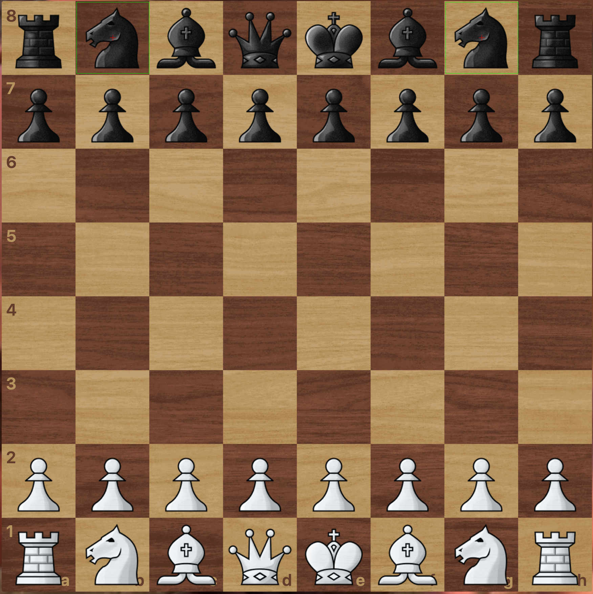

# rust-templateMatching-pure

Pure-Rust template matching — no OpenCV, no C dependencies, no cmake.  
Finds one or more occurrences of a template image inside a scene image.

## Features

- **Pure Rust** — no system libraries, compiles anywhere `rustc` runs
- **High performance** — SIMD-accelerated via `target-cpu=native`, Gaussian image pyramid, integral-image statistics
- **Cross-platform** — Linux, macOS, Windows (x86-64 and ARM64)
- **Single dependency** — [`image`](https://crates.io/crates/image) for PNG/JPEG/BMP I/O

## Build

```bash
cargo build --release
```

## Usage

```bash
./target/release/rust_tm_pure <template> <scene> [score_thresh] [max_count] [angle] [min_area]
```

| Argument | Default | Description |
|---|---|---|
| `score_thresh` | `0.7` | Minimum match score (0–1) |
| `max_count` | `10` | Maximum number of matches |
| `angle` | `0.0` | Search rotation angle in degrees |
| `min_area` | `256` | Minimum template area in pixels |

## Example

```bash
./target/release/rust_tm_pure template_matching_template.png template_matching_scene.png
```

| Template | Scene | Result |
|:---:|:---:|:---:|
|  |  |  |

```
Results (2 matches):
  [0]  center: (333.00, 111.00)   score: 1.0000
  [1]  center: (1423.00, 111.00)  score: 0.8142

~0.9 ms  (Apple M-series, release build)
```

Matches are outlined in green, centers marked in red.
